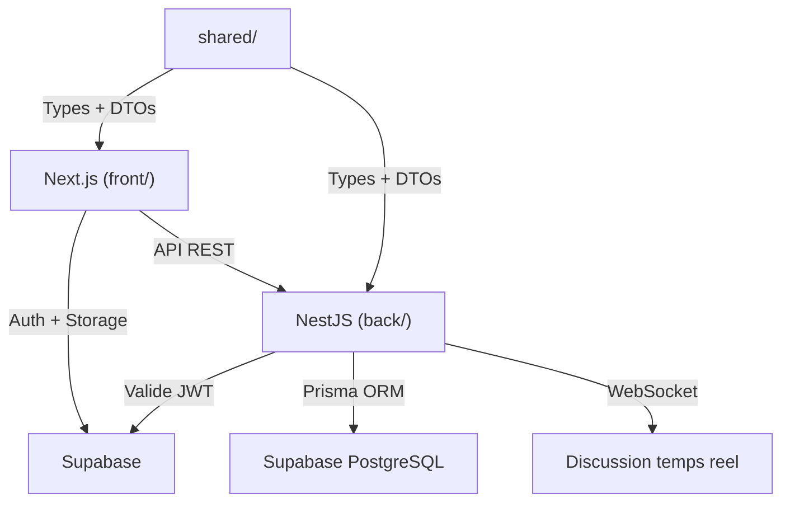

# Plan MVP - Machine d'Influence

## Architecture globale



---

## 0. Setup fondation (prerequis a toutes les epics)

### Backend ([back/](back/))

- Installer **Prisma** comme ORM (`@prisma/client`, `prisma`)
- Installer **@nestjs/config** pour la gestion des variables d'environnement
- Installer **@supabase/supabase-js** pour la validation des JWT
- Installer **@nestjs/websockets** et **socket.io** pour la discussion temps reel
- Creer le fichier `back/.env` avec les variables Supabase (URL, anon key, service role key, database URL)
- Initialiser Prisma avec le schema de base

### Frontend ([front/](front/))

- Installer **@supabase/ssr** pour l'auth Supabase cote Next.js
- Creer un client Supabase (`front/src/lib/supabase/client.ts` et `server.ts`)
- Mettre en place le layout global avec navigation conditionnelle (auth/non-auth)
- Creer les composants UI de base reutilisables (Button, Input, Card, Modal, Avatar)

### Shared ([shared/](shared/))

- Structurer le dossier : `shared/types/`, `shared/enums/`, `shared/dto/`
- Definir les enums partages : `UserRole` (RECRUITER, INDEPENDENT), `AnnonceStatus`, `CandidatureStatus`, etc.

### Schema Prisma (modele de donnees)

```prisma
model User {
  id              String   @id @default(uuid())
  supabaseId      String   @unique
  email           String   @unique
  role            UserRole
  firstName       String?
  lastName        String?
  profilePicture  String?
  description     String?
  skills          String[]
  rate            Float?
  isProfileComplete Boolean @default(false)
  createdAt       DateTime @default(now())
  updatedAt       DateTime @updatedAt

  annonces        Annonce[]
  candidatures    Candidature[]
  sentMessages    Message[]       @relation("sender")
  conversations   ConversationParticipant[]
}

model Annonce {
  id          String        @id @default(uuid())
  recruiter   User          @relation(fields: [recruiterId], references: [id])
  recruiterId String
  title       String
  description String
  skills      String[]
  location    String?
  budget      Float?
  status      AnnonceStatus @default(ACTIVE)
  createdAt   DateTime      @default(now())
  updatedAt   DateTime      @updatedAt

  candidatures Candidature[]
}

model Candidature {
  id        String            @id @default(uuid())
  annonce   Annonce           @relation(fields: [annonceId], references: [id])
  annonceId String
  candidat  User              @relation(fields: [candidatId], references: [id])
  candidatId String
  message   String?
  status    CandidatureStatus @default(PENDING)
  createdAt DateTime          @default(now())
}

model Conversation {
  id        String   @id @default(uuid())
  createdAt DateTime @default(now())

  participants ConversationParticipant[]
  messages     Message[]
}

model ConversationParticipant {
  id             String       @id @default(uuid())
  conversation   Conversation @relation(fields: [conversationId], references: [id])
  conversationId String
  user           User         @relation(fields: [userId], references: [id])
  userId         String

  @@unique([conversationId, userId])
}

model Message {
  id             String       @id @default(uuid())
  conversation   Conversation @relation(fields: [conversationId], references: [id])
  conversationId String
  sender         User         @relation("sender", fields: [senderId], references: [id])
  senderId       String
  content        String
  readAt         DateTime?
  createdAt      DateTime     @default(now())
}

enum UserRole {
  RECRUITER
  INDEPENDENT
}

enum AnnonceStatus {
  ACTIVE
  CLOSED
  DRAFT
}

enum CandidatureStatus {
  PENDING
  ACCEPTED
  REJECTED
}
```

---

## EPIC 1 - Authentification

### Backend

- Creer un **AuthModule** avec un guard Supabase qui valide le JWT dans le header `Authorization`
- Creer un **UsersModule** avec un CRUD basique :
  - `POST /auth/callback` : webhook appele apres inscription Supabase pour creer le User en base avec le role choisi
  - `GET /users/me` : retourne le profil de l'utilisateur connecte
  - `PATCH /users/me` : met a jour le profil

### Frontend

- **Page `/login`**: formulaire email/password, appel`supabase.auth.signInWithPassword()`
- **Page `/register`**: formulaire email/password + choix du role (Recruteur ou Independant), appel`supabase.auth.signUp()` puis POST vers le backend pour creer le profil
- **Middleware Next.js** (`front/src/middleware.ts`) : protege les routes authentifiees, redirige vers `/login` si non connecte
- Gestion du state auth via un **AuthProvider** React Context qui ecoute `onAuthStateChange`

### Shared

- Types : `LoginDto`, `RegisterDto`, `UserResponse`

---

## EPIC 2 - Homepage

### Frontend

- **Page `/`** (homepage publique) :
  - Hero section avec titre accrocheur et CTA (s'inscrire / se connecter)
  - Section "Comment ca marche" en 3 etapes
  - Section annonces recentes (preview de 3-4 annonces)
  - Section candidats mis en avant (preview de 3-4 profils)
  - Footer avec liens utiles

### Backend

- `GET /annonces/featured` : retourne les dernieres annonces actives (limit 4)
- `GET /users/featured` : retourne des profils complets mis en avant (limit 4)

---

## EPIC 3 - Profil candidat

### Backend

- `GET /users/:id` : profil public d'un utilisateur
- `PATCH /users/me` : mise a jour du profil (prenom, nom, description, competences, tarif)
- `POST /users/me/avatar` : upload de photo de profil vers Supabase Storage, sauvegarde de l'URL en base
- Logique `isProfileComplete` : passe a `true` quand firstName, lastName, description et skills sont remplis

### Frontend

- **Page `/profile`** : page profil de l'utilisateur connecte avec deux onglets :
  - **Candidat** : formulaire d'edition du profil (photo, infos, description, competences, tarif)
  - **Mes annonces** : liste des annonces publiees (si recruteur) ou candidatures envoyees (si independant)
- **Page `/candidats/:id`** (fiche candidat publique) :
  - Photo de profil
  - Informations (nom, prenom)
  - Description
  - Competences (tags)
  - Tarif
  - Bouton "Contacter" (cree une conversation et redirige vers `/discussion`)

---

## EPIC 4 - Annonces

### Backend

- **AnnoncesModule** :
  - `GET /annonces` : liste paginee avec filtres (skills, location, search)
  - `GET /annonces/:id` : detail d'une annonce
  - `POST /annonces` : creation (recruteur uniquement, guard role)
  - `PATCH /annonces/:id` : modification (auteur uniquement)
  - `DELETE /annonces/:id` : suppression (auteur uniquement)

### Frontend

- **Page `/annonces`** : liste des annonces avec barre de recherche et filtres (competences, localisation)
- **Page `/annonces/:id`** : detail d'une annonce avec informations completes + bouton "Candidater" (pour independant) ou infos recruteur
- **Page `/annonces/create`** : formulaire de creation d'annonce (titre, description, competences requises, lieu, budget)

---

## EPIC 5 - Candidatures

### Backend

- **CandidaturesModule** :
  - `POST /annonces/:id/candidatures` : un independant candidater a une annonce
  - `GET /annonces/:id/candidatures` : le recruteur voit les candidatures recues
  - `PATCH /candidatures/:id` : accepter/refuser une candidature (cree automatiquement une conversation si acceptee)
- **Page `/candidats`** : liste paginee des candidats avec profil complet, filtres par competences

### Frontend

- **Page `/candidats`** : grille de fiches candidats avec photo, nom, competences, tarif
- Bouton "Candidater" sur la page detail annonce -> ouvre une modale avec message optionnel
- Dans le profil recruteur, section "Candidatures recues" par annonce

---

## EPIC 6 - Discussion

### Backend

- **ChatModule** avec **WebSocket Gateway** (Socket.IO) :
  - `GET /conversations` : liste des conversations de l'utilisateur connecte
  - `GET /conversations/:id/messages` : messages pagines d'une conversation
  - Gateway WebSocket :
    - Event `joinConversation` : rejoint une room Socket.IO
    - Event `sendMessage` : envoie un message en temps reel, persiste en base
    - Event `newMessage` : broadcast aux participants de la conversation
    - Event `markAsRead` : marque les messages comme lus
- Creation automatique d'une conversation quand :
  - Un recruteur clique "Contacter" sur une fiche candidat
  - Une candidature est acceptee

### Frontend

- **Page `/discussion`** : layout en deux colonnes
  - Colonne gauche : liste des conversations (avatar, nom, dernier message, date)
  - Colonne droite : fil de messages de la conversation selectionnee
  - Input de message en bas avec envoi en temps reel
  - Indicateur de messages non lus
- Integration Socket.IO client (`socket.io-client`)

---

## Structure de fichiers cible

```
machine-influence/
  front/
    src/
      app/
        (auth)/
          login/page.tsx
          register/page.tsx
        (main)/
          layout.tsx          # Layout avec navbar
          page.tsx            # Homepage
          annonces/
            page.tsx          # Liste annonces
            [id]/page.tsx     # Detail annonce
            create/page.tsx   # Creation annonce
          candidats/
            page.tsx          # Liste candidats
            [id]/page.tsx     # Fiche candidat
          profile/page.tsx    # Mon profil
          discussion/page.tsx # Messagerie
      components/
        ui/                   # Button, Input, Card, Modal, Avatar, Tag
        layout/               # Navbar, Footer, Sidebar
        annonces/             # AnnonceCard, AnnonceForm, AnnonceFilters
        candidats/            # CandidatCard, CandidatFilters
        discussion/           # ConversationList, MessageThread, MessageInput
        profile/              # ProfileForm, ProfileTabs
      lib/
        supabase/
          client.ts           # Client Supabase browser
          server.ts           # Client Supabase server
        api.ts                # Client fetch vers le backend NestJS
        socket.ts             # Client Socket.IO
      hooks/
        useAuth.ts
        useSocket.ts
      providers/
        AuthProvider.tsx
      middleware.ts

  back/
    src/
      auth/
        auth.module.ts
        auth.guard.ts         # Supabase JWT validation
        roles.guard.ts        # Role-based access
        roles.decorator.ts
      users/
        users.module.ts
        users.controller.ts
        users.service.ts
      annonces/
        annonces.module.ts
        annonces.controller.ts
        annonces.service.ts
      candidatures/
        candidatures.module.ts
        candidatures.controller.ts
        candidatures.service.ts
      chat/
        chat.module.ts
        chat.controller.ts
        chat.service.ts
        chat.gateway.ts       # WebSocket gateway
      prisma/
        prisma.module.ts
        prisma.service.ts
    prisma/
      schema.prisma

  shared/
    types/
      user.ts
      annonce.ts
      candidature.ts
      conversation.ts
      message.ts
    enums/
      index.ts
    dto/
      auth.dto.ts
      annonce.dto.ts
      candidature.dto.ts
```

---

## Ordre de developpement recommande

L'ordre suit les dependances naturelles :

1. **Setup fondation** (jour 1) : Prisma, Supabase clients, composants UI de base
2. **EPIC 1 - Auth** (jour 2-3) : prerequis a tout le reste
3. **EPIC 2 - Homepage** (jour 3) : page vitrine, rapide a faire
4. **EPIC 3 - Profil** (jour 4-5) : necessaire pour les candidats et les annonces
5. **EPIC 4 - Annonces** (jour 5-7) : CRUD complet
6. **EPIC 5 - Candidatures** (jour 7-8) : depend des annonces et des profils
7. **EPIC 6 - Discussion** (jour 8-10) : le plus complexe, a faire en dernier

Les epics 4 et 5 peuvent etre developpees en parallele par des developpeurs differents une fois l'auth et les profils en place.

---

## Dependances a installer

### Frontend

```bash
cd front && pnpm add @supabase/ssr @supabase/supabase-js socket.io-client
```

### Backend

```bash
cd back && pnpm add @nestjs/config @supabase/supabase-js @prisma/client @nestjs/websockets @nestjs/platform-socket.io class-validator class-transformer
cd back && pnpm add -D prisma
```
